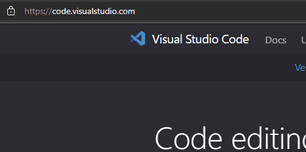
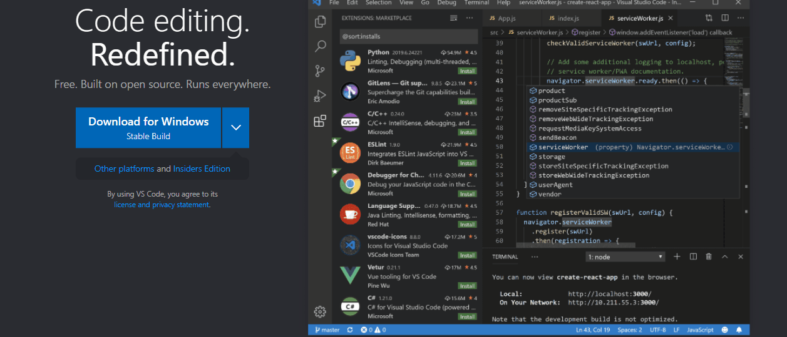
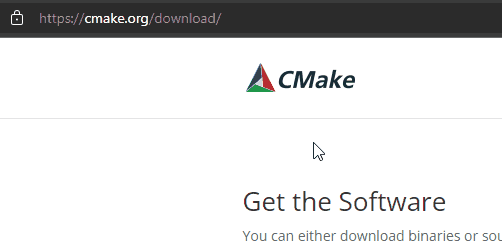
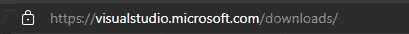
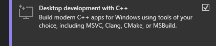

# C++ CMake for Visual Studio Code Template

This is a template repository that people can use to write their C++ Code.
This repository is catered towards beginner developers who have no idea how
to start out in writing cross platform C++ code.

**NOTE**: This is not a full tutorial (yet) on how to setup and get started
with C++ Development Environment, it only covers the tip of the iceberg on
how to get started.

## Prerequisites

Before using this repository, we have to download:
- CMake
- Visual Studio Code
    - with C/C++ Extension
- C++ compiler
  - Linux
    - Clang (`clang++`) pronounced `klang` not `see-lang`
    - GNU Compiler Collection (`g++`) or
  - Windows
    - Microsoft's Visual C++ Compiler (`cl.exe`) or
    - MSYS2 MinGW (`g++.exe`)
  - Mac
    - Clang (`clang++`) pronounced `klang` not `see-lang`
-  Git or Git for Windows

## Visual Studio Code

Download **Visual Studio Code** in the official site:

Download the **Windows Stable Build** (this expects that you are using Windows):

After downloading Visual Studio Code, go through the install process

> For starters, you can just keep clicking next until the install finishes

Open VSCode and open it in the folder where you downloaded this repository

## CMake

Grab **CMake** by downloading a copy from the original website:

Same process applies in the CMake installer, just click next until the setup
finishes.

## MSYS2 or Microsoft Visual C++ Compiler

In Windows, you have two options for using a compiler.

I would recommend the MSVC compiler as it is authored by Microsoft and I believe
it is the best compiler in Windows.

But if you cannot use MSVC you can use GCC or specifically MSYS2 MinGW.

### MSVC

To install MSVC just download the latest Visual Studio IDE Community
Edition and select the Desktop Development with C++

[Download Visual Studio here](https://visualstudio.microsoft.com/)

Then check the Desktop Development with C++:

### MSYS2

MSYS2 has a great documentation for setting up the GCC toolchain in windows.

[Click here to visit the getting started guide](https://www.msys2.org/)

## Git for Windows

Make sure you have git for windows when using this repository, learn how git
works and how to clone repositories, stage, commit, and push changes and make
pull requests.

> It is one of the most essential tools that a programmer/developer should know
> in their toolbelt. You can skip and download this repository but it is more
> convenient when your changes are logged and tracked so that you can revert
> anytime you want.

[Watch this 1 hour tutorial in youtube about Git and Github](https://www.youtube.com/watch?v=RGOj5yH7evkj)

## How to Navigate and use this Repository

You can start writing code in `src/main.cpp` just click the `src` folder and open
`main.cpp` and there you can see a very basic hello world program.

You can extend the program from here.

